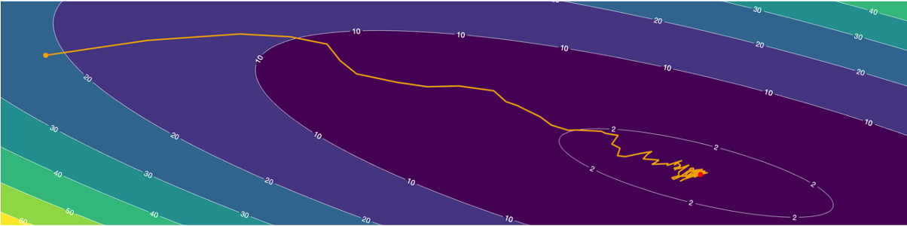
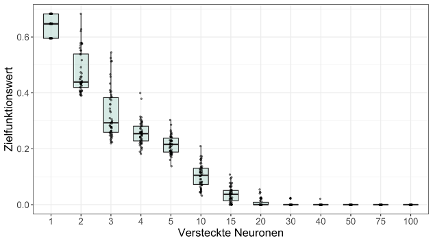
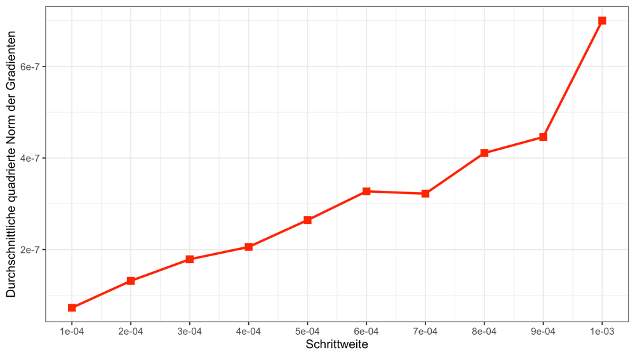

# Gradient-Based Methods for the Training of Neural Networks

This repository contains the work from my bachelor’s thesis, completed under the supervision of [Professor Karsten Urban](https://www.uni-ulm.de/mawi/institut-fuer-numerische-mathematik/institut/mitarbeiter/prof-dr-karsten-urban/) at the Institute of Numerical Mathematics, Ulm University. This thesis was my first experience working with neural networks, and it helped me build a solid foundation for my Master’s in Data Science, for which I am very grateful. In the following, I want to give a brief overview over my work.

### Motivation
Specializing in numerical mathematics and mathematical optimization during my bachelor’s, I came from a world where most optimization problems were convex and therefore had a unique solution. This typically even allowed for deriving bounds on how quickly certain optimization algorithms would converge to that solution. I was surprised to learn that the crucial problem of optimizing neural networks lacked these favorable properties I was accustomed to. Moreover, we have little understanding of the loss landscape, and due to the sheer dimensionality of the problem, we are essentially limited to using simple first-order optimization algorithms, such as gradient descent.

Yet, despite the lack of all these guarantees, it simply seems to work in practice. The fact that neural networks can be trained reasonably reliably and that the loss decreases with well-chosen parameters is one of the reasons for the AI revolution we are currently witnessing. In my work, I have attempted to gather several possible explanations for this phenomenon and conducted some experiments to better understand the problem.

### Properties of the Optimization Problem

First, I derived the optimization problem underlying neural networks. By applying the chain rule, it becomes fairly easy to see that - for common choices of activation functions - the loss function is sufficiently smooth (except for a negligible set of points) and bounded from below. This justifies the use of first-order optimization algorithms, such as gradient descent.

### The Loss Landscape has (almost) no bad local Minima

One of the nightmares that mathematicians like me face when optimizing non-convex functions is the existence of ‘bad’ local minima, which have a much higher loss than the global minimum. The reason for this is that most of the optimization algorithms in our toolbox can get stuck in these local minima. But do such local minima even exist for the loss landscape of neural networks?

- I start by examining the model identifiability problem, which reveals that the loss landscape of neural networks often exhibits many symmetries. These symmetries imply the existence of numerous (even uncountably many) local minima that are equivalent to one another. This could explain why the optimization of neural networks is not overly sensitive to the starting point.
- [Baldi and Hornik](http://www.vision.jhu.edu/teaching/learning/deeplearning19/assets/Baldi_Hornik-89.pdf) provide evidence against the existence of “bad” local minima. For a specific class of neural networks, they demonstrate that every local minimum is also a global minimum.
- [Soudry and Carmon](https://arxiv.org/abs/1605.08361) offer additional evidence against bad local minima. For a common class of neural networks, they show that if the network is made sufficiently wide, there are no local minima that are not also global minima.
- Finally, I considered some experimental evidence by [Dauphin et al.](https://arxiv.org/abs/1406.2572), who found that the Hessian matrix of the objective function tends to have more positive eigenvalues at stationary points with lower costs. Since a local minimum is characterized as a point where the Hessian has only positive eigenvalues, this suggests that stationary points with high errors are more likely to be saddle points, whereas local minima tend to have low errors.

### Gradient Descent converges (almost surely) against a Local Minimum

So, if local minima tend to have a similar loss to the global minimum, why bother chasing the global minimum? Just show me how to end up in a local one! Well, it’s not quite that simple, but we’ll get there.

- First, let’s consider what makes neural networks so powerful. By design, they are highly complex, consisting of multiple layers that enable them to approximate any function you can think of (as long as they are sufficiently wide). But how do we compute properties like the gradient for such a complex function? Fortunately, in the 1980s, Hinton et al. figured out that one can derive the gradient by repeatedly applying the chain rule, leading to the backpropagation algorithm, which laid the foundation for the entire field of AI as we know it today.
- This enables us to apply gradient descent to this problem. A basic result taught in every optimization class is that if the loss function is sufficiently smooth and the step size is small enough, gradient descent will converge to a critical point, which could be a local minimum, maximum, or saddle point.
- While local minima are certainly one type of critical point, local maxima are another. If we’re unlucky and start at a local maximum (where the gradient is zero) or accidentally step into one, we won’t be able to escape it—there’s nothing we can do about that. But can we at least say that this is unlikely to happen?  A recent paper by [Lee et al](https://arxiv.org/abs/1602.04915) provides exactly that reassurance. Under mild conditions on the loss function, they show that if the initial point is chosen randomly, the probability of converging to a saddle point with a strictly negative curvature in at least one direction is zero.

### Stochastic Gradient Descent behaves similar as Gradient Descent

So far, we assumed that we can simply throw gradient descent at the optimization problem. Unfortunately, the loss function depends on every sample in our dataset, meaning we need the entire dataset in memory for just one evaluation of the loss. This quickly becomes prohibitive for larger datasets.

- To address this, we randomly select a subset of training examples and compute the loss and its gradient based only on this subset. This approach provides an unbiased estimate of the gradient, which we can use in place of the true gradient. This leads us to the stochastic gradient descent (SGD) algorithm, which is widely used to train neural networks.
- The first result we find is that using stochastic gradient descent with a fixed step size will, on average, bring us to a point where the gradient is close to zero (likely near a saddle point). The smaller the step size, the smaller the gradient will be.
- Furthermore, by using certain step size schedules, [Robbins and Monro](https://projecteuclid.org/journals/annals-of-mathematical-statistics/volume-22/issue-3/A-Stochastic-Approximation-Method/10.1214/aoms/1177729586.full) showed that, in expectation, stochastic gradient descent also converges to a critical point (such as a saddle point) of the loss function.
- Even more, [Ge et al.](https://arxiv.org/abs/1503.02101) demonstrate that under certain assumptions about the loss function, and by using a slightly modified version of stochastic gradient descent, we can expect to end up close to a local minimum. So we are good.

### Numerical Experiments

In my first experiment, I examined the result by Soudry and Carmon. They state that for a sufficiently large number of neurons per layer, all local minima coincide with the global minimum. However, the number of neurons required per layer for this result is extremely high, making it impractical in real-world scenarios. To explore this further, I observed what happens as the number of neurons approaches the theoretical requirement. I considered a neural network with one hidden layer and varying numbers of neurons for a relatively simple dataset. For each configuration, I used gradient descent with a sufficiently small step size to find multiple local minima. I then compared these local minima to see if there were any “bad” local minima with significantly higher values than the others.

As shown in the plot below, the function values of the local minima become increasingly similar as the number of neurons in the hidden layer increases. This suggests that if the network is made wide enough, all local minima converge to similar values, reducing the risk of encountering bad local minima.

In my third experiment, I revisited the result related to stochastic gradient descent, which states that after a certain number of iterations, the algorithm is expected to reach a point where the gradient is close to zero, and further, the expected norm of that gradient is proportional to the step size. This means that if a smaller step size is chosen, after some number of iterations, we are more expected to end up at points with lower gradient norms (“closer to a saddle point”). As to be expected, I was able to observe the theoretical result in practice using the MNIST classification problem.

